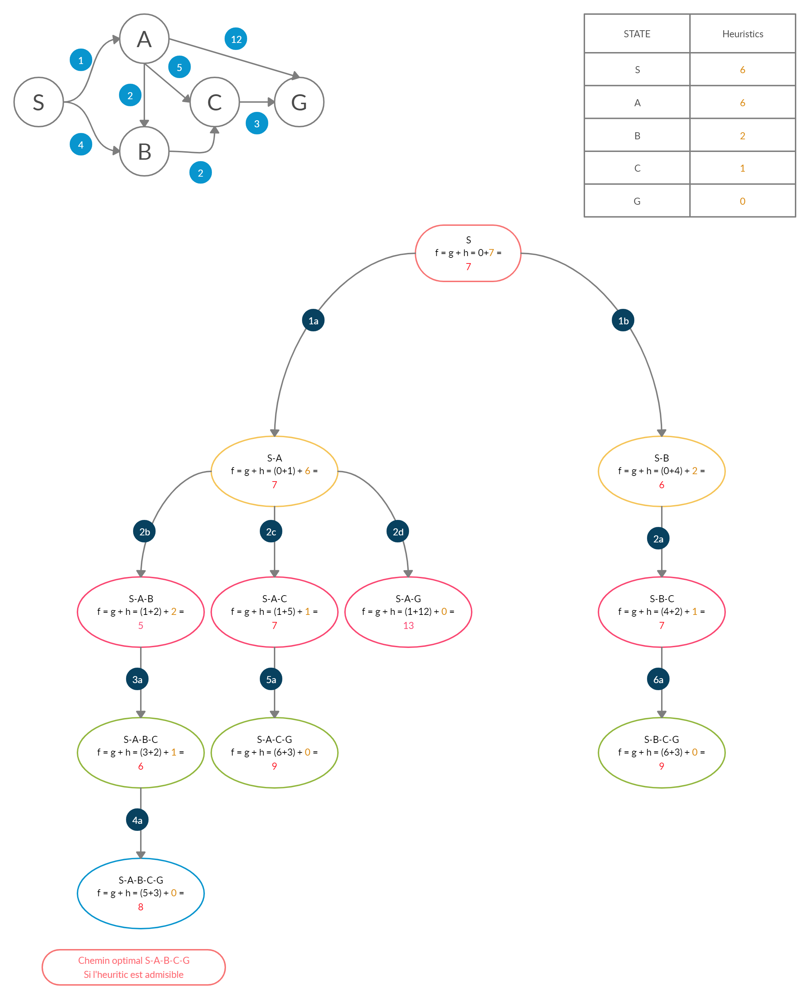

# A* (Astar)

A* est un algorithme de recherche de chemin dans un graphe entre un noeud initial et un noeud final.
[Pour plus d'informations](https://fr.wikipedia.org/wiki/Algorithme_A*)

## Utilisation du programme

Pour utiliser le programme, il faut se rendre dans le dossier **Astar** puis mettre les commandes suivantes.

```shell
javac -d build graph/*.java
java -cp builf graph/Demo
```
Pour générer la javadoc, il suffit de mettre la commande suivante :

```shell
javadoc -d Javadoc graph/*.java
```

## Exemple

Ici nous cherchons le chemin le plus court entre le noeud S et le noeud G.



## Pseudo-code

Voici le pseudo-code utilisé pour mettre au point le programme :

```c
function reconstruct_path(cameFrom, current)
    total_path := {current}
    while current in cameFrom.Keys:
        current := cameFrom[current]
        total_path.prepend(current)
    return total_path

// A* finds a path from start to goal.
// h is the heuristic function. h(n) estimates the cost to reach goal from node n.
function A_Star(start, goal, h)

    // The set of discovered nodes that need to be (re-)expanded.
    // Initially, only the start node is known.
    openSet := {start}

    // For node n, cameFrom[n] is the node immediately preceding it on the cheapest path from start to n currently known.
    cameFrom := an empty map

    // For node n, gScore[n] is the cost of the cheapest path from start to n currently known.
    gScore := map with default value of Infinity
    gScore[start] := 0

    // For node n, fScore[n] := gScore[n] + h(n).
    fScore := map with default value of Infinity
    fScore[start] := h(start)

    while openSet is not empty
        current := the node in openSet having the lowest fScore[] value
        if current = goal
            return reconstruct_path(cameFrom, current)

        openSet.Remove(current)
        closedSet.Add(current)
        for each neighbor of current
            if neighbor in closedSet
                continue
            // d(current,neighbor) is the weight of the edge from current to neighbor
            // tentative_gScore is the distance from start to the neighbor through current
            tentative_gScore := gScore[current] + d(current, neighbor)
            if neighbor not in openSet
                openSet.add(neighbor)
            if tentative_gScore < gScore[neighbor]
                // This path to neighbor is better than any previous one. Record it!
                cameFrom[neighbor] := current
                gScore[neighbor] := tentative_gScore
                fScore[neighbor] := gScore[neighbor] + h(neighbor)

    // Open set is empty but goal was never reached
    return failure
```
